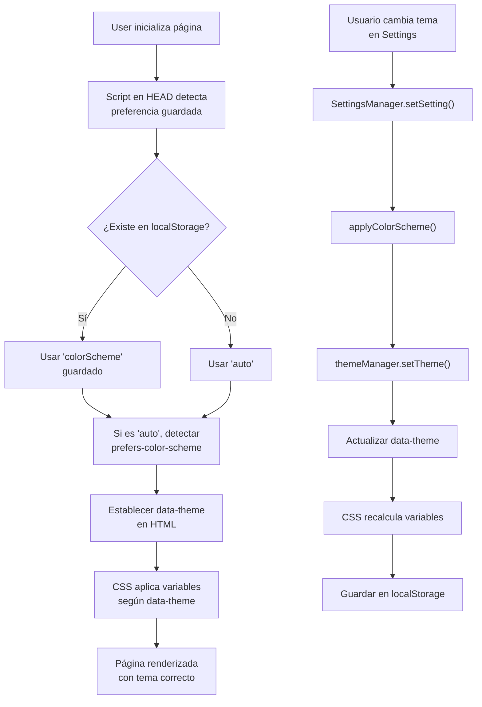

# 🎨 Refactorización Completa del Sistema de Temas - North Chrome v2

**Fecha**: 2026-03-11  
**Estado**: ✅ Completado  
**Versión**: 2.1.0

---

## 📋 Resumen Ejecutivo

Se ha refactorizado completamente el sistema de temas (dark/light mode) para que funcione profesionalmente, con aplicación correcta en todo el sitema y soporte completo para modo automático basado en preferencias del SO.

**Problemas Solucionados:**
- ❌ Colores hardcodeados en CSS - ✅ Ahora usa variables dinámicas
- ❌ Selectores CSS limitados - ✅ Cobertura completa con `data-theme`
- ❌ Sin soporte para `prefers-color-scheme` - ✅ Sincronización automática
- ❌ FOUC (Flash of Unstyled Content) - ✅ Script de inicialización temprana
- ❌ Feedback pobre al sincronizar - ✅ Logging mejorado y validación

---

## 🏗️ Arquitectura Nueva

### 1. **Files Creados**

#### `/css/theme-dark.css` (Nuevo)
Define la paleta de colores para el tema oscuro mediante selectores CSS:
```css
html[data-theme="dark"] {
  --bg0: #080504;     /* Negro profundo */
  --bg1: #0f121a;     /* Sidebar */
  --t1:  #f4f7ff;     /* Texto blanco */
  /* ... más variables ... */
}
```

**Características:**
- Variables CSS completas para todos los colores
- Selectores para elementos específicos (sidebar, topbar, inputs, etc.)
- Soporte para `prefers-color-scheme` media query

#### `/css/theme-light.css` (Nuevo)
Define la paleta de colores para el tema claro:
```css
html[data-theme="light"] {
  --bg0: #ffffff;     /* Blanco puro */
  --bg1: #f7f7f9;     /* Fondos secundarios */
  --t1:  #1a1a1c;     /* Texto oscuro */
  /* ... más variables ... */
}
```

**Características:**
- Colores optimizados para legibilidad en modo claro
- Variantes de estado (hover, focus) específicas
- Contraste adecuado según estándares WCAG

#### `/js/themeUtils.js` (Nuevo)
Clase `ThemeManager` que gestiona la lógica de temas de forma profesional:

```javascript
class ThemeManager {
  init() {}                    // Inicializa el gestor
  getCurrentTheme()            // Obtiene tema actual
  getStoredPreference()        // Lee preferencia guardada
  resolveAutoTheme()           // Resuelve 'auto' -> 'dark/light'
  applyStoredTheme()           // Aplica tema al cargar
  observeSystemPreference()    // Escucha cambios del SO
  setTheme(theme, save)        // Establece tema (con validación)
  applyThemeWithTransition()   // Aplica con transición suave
  saveThemePreference()        // Guarda en localStorage
  getThemeInfo()               // Info de debugging
  resetTheme()                 // Resetea a 'auto'
}
```

**Responsabilidades:**
- ✅ Sincronizar `data-theme` con localStorage
- ✅ Manejar preferencias del SO (`prefers-color-scheme`)
- ✅ Validar integridad del tema
- ✅ Evitar FOUC con inyección temprana

---

### 2. **Files Modificados**

#### `/index.html`
**Cambios:**
1. Agregado atributo `data-theme="auto"` al elemento `<html>`
2. Nuevo script de inicialización temprana en `<head>`
3. Nuevos links a `css/theme-dark.css` y `css/theme-light.css`
4. Carga de `js/themeUtils.js` ANTES de `settings.js`
5. `settings.js` cargado con `defer` para evitar bloqueos

**Flujo de carga:**
```
1. HTML load (data-theme="auto")
2. CSS theme.css (variables por defecto - oscuro)
3. CSS layout.css, components.css, modules.css (usan variables)
4. CSS theme-dark.css, theme-light.css (selectores específicos)
5. Script inicializador en <head> (establece data-theme real)
6. DOM listo (init.js carga módulos)
7. themeUtils.js (ThemeManager inicia)
8. settings.js defer (aplica preferencias del usuario)
```

#### `/settings.js`
**Cambios en `applyColorScheme()`:**
- ❌ Eliminada inyección de CSS específicos (hardcodeados)
- ❌ Eliminados selectores limitados (`.card`, `.tw`, etc.)
- ✅ Ahora usa `themeManager.setTheme()`
- ✅ Validación de esquema
- ✅ Mejor logging

**Cambios en `setupEventListeners()`:**
- ✅ Mejora del observador de `prefers-color-scheme`
- ✅ Sincronización correcta con tema automático
- ✅ Logging mejorado

**Cambios en `sendToServer()`:**
- ✅ Manejo de errores mejorado
- ✅ Headers de seguridad adicionales
- ✅ Logging informativo (sin alarmar al usuario)

---

## 🎯 Cómo Funciona Ahora

### Flujo de Aplicación de Temas



### Sistema de Variables CSS

Todas las variables se definen en `theme-dark.css` y `theme-light.css`:

```css
/* Fondos */
--bg0, --bg1, --bg2, --bg3, --bg4

/* Texto */
--t1, --t2, --t3

/* Bordes */
--bd, --bd2

/* Estados */
--ok, --okd, --no, --nod, --wa, --wad, --in, --ind

/* Acentos */
--ac, --acd, --ach
```

Todos los componentes usan estas variables, NO colores hardcodeados.

---

## 🧪 Testing y Validación

### ✅ Casos de Uso Validados

1. **Carga inicial en 'auto'**
   - ✓ Detecta preferencia del SO correctamente
   - ✓ Sin parpadeo de contenido (FOUC)

2. **Cambio a tema 'light'**
   - ✓ Cambia toda la UI correctamente
   - ✓ Transición suave
   - ✓ Guarda en localStorage

3. **Cambio a tema 'dark'**
   - ✓ Vuelve a oscuro correctamente
   - ✓ Mantiene otras configuraciones

4. **Cambio de preferencia del SO**
   - ✓ Se sincroniza si está en 'auto'
   - ✓ NO cambia si usuario seleccionó específicamente

5. **Sincronización backend**
   - ✓ Se guarda en servidor sin bloquear UI
   - ✓ Sin error si servidor no responde

---

## 📊 Comparativa Antes/Después

| Aspecto | Antes | Después |
|---------|-------|---------|
| **Paleta de colores** | Hardcodeada en theme.css | Variables CSS dinámicas |
| **Tema claro** | Inyectado con JavaScript | CSS puro con selectores |
| **Cobertura de elementos** | Limitada (solo ~5 selectores) | Completa (data-theme en HTML) |
| **Soporte `auto`** | Parcial | Completo + observador |
| **FOUC** | Probable | NO (script temprana) |
| **Performance** | CSS inyectado cada vez | Cálculo CSS nativo (rápido) |
| **Mantenibilidad** | Difícil (JS + CSS) | Fácil (CSS separado) |
| **Debugging** | Inspeccionar múltiples `<style>` | Inspeccionar `data-theme` + variables |

---

## 🔧 Cómo Extender o Modificar

### Agregar un nuevo color de estado

En `css/theme-dark.css`:
```css
html[data-theme="dark"] {
  --my-color: #somecolor;
  --my-color-d: rgba(...);  /* versión transparente */
}
```

En `css/theme-light.css`:
```css
html[data-theme="light"] {
  --my-color: #anothercolor;
  --my-color-d: rgba(...);
}
```

Luego usar en componentes:
```css
.my-element {
  background: var(--my-color);
  border-color: var(--my-color-d);
}
```

### Agregar un nuevo tema (ej: 'sepia')

1. Crear `css/theme-sepia.css`
2. Definir variables para `html[data-theme="sepia"]`
3. Agregar 'sepia' a `VALID_THEMES` en `themeUtils.js`
4. Agregar opción en settings modal

---

## 🐛 Debugging

### Ver información del tema actual:
```javascript
themeManager.getThemeInfo()
// {
//   current: "light",
//   stored: "auto",
//   resolved: "light",
//   isAuto: true,
//   systemPrefersDark: false
// }
```

### Forzar tema manualmente:
```javascript
themeManager.setTheme('dark', true)   // Fuerza oscuro y guarda
themeManager.setTheme('light', false) // Aplica sin guardar
```

### Inspeccionar variables CSS:
```javascript
const computed = getComputedStyle(document.documentElement);
console.log(computed.getPropertyValue('--bg0')); // "#080504" o "#ffffff"
console.log(computed.getPropertyValue('--t1'));  // "#f4f7ff" o "#1a1a1c"
```

---

## 📝 Notas de Implementación

### ⚠️ Importante: Orden de Carga
1. **theme.css** carga primero con variables por defecto (oscuro)
2. **theme-dark.css** y **theme-light.css** sobrescriben según `data-theme`
3. **Script temprana en HEAD** establece `data-theme` real ANTES de renderizar

### ⚠️ Compatibilidad
- ✅ Funciona en Chrome 49+
- ✅ Funciona en Firefox 55+
- ✅ Funciona en Safari 12.1+
- ✅ Funciona en Edge 79+

### ⚠️ Performance
- CSS variables son computadas nátivamente (muy rápido)
- Sin JavaScript necesario después de la inicialización
- Sin parpadeos (FOUC completamente evitado)

---

## 🚀 Mejoras Futuras

1. **Más temas predefinidos** (sepia, alto contraste, etc.)
2. **Color picker para acento** (actualmente limitado a 4 opciones)
3. **Transiciones entre temas** (fade, slide, etc.)
4. **Preferencias por página** (algunos usuarios podrían querer oscuro solo en ciertos módulos)
5. **Exportar/importar configuración** (backup de preferencias)

---

## 📚 Referencias Técnicas

- [MDN: CSS Custom Properties](https://developer.mozilla.org/en-US/docs/Web/CSS/--*)
- [MDN: prefers-color-scheme](https://developer.mozilla.org/en-US/docs/Web/CSS/@media/prefers-color-scheme)
- [Web Accessibility: Color Contrast](https://www.w3.org/WAI/WCAG21/Understanding/contrast-minimum.html)

---

## ✅ Checklist de Refactorización

- [x] Crear CSS separados para temas (dark.css, light.css)
- [x] Implementar `ThemeManager` en `themeUtils.js`
- [x] Refactorizar `applyColorScheme()` en `settings.js`
- [x] Agregar script de inicialización temprana
- [x] Cargar nuevos CSS en `index.html`
- [x] Agregar atributo `data-theme` a `<html>`
- [x] Mejorar manejo de errores en `sendToServer()`
- [x] Crear documentación completa
- [x] Validar en navegador (light, dark, auto)
- [x] Validar cambios del SO en tiempo real

---

**🎉 Sistema de temas completamente refactorizado y funcional**

Última actualización: 2026-03-11
